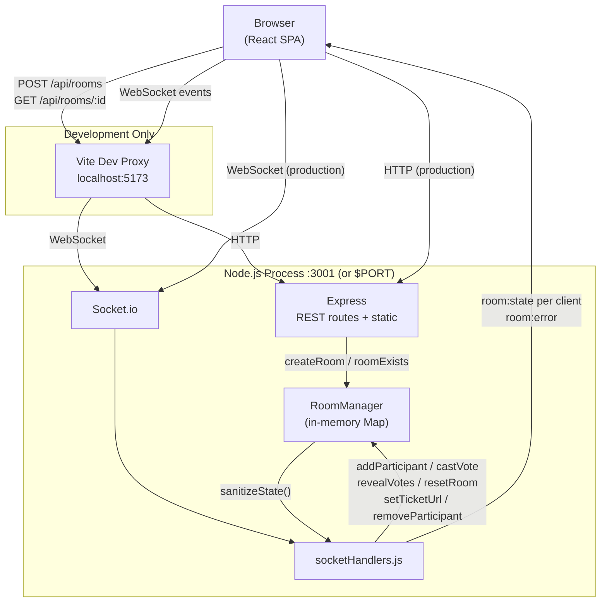
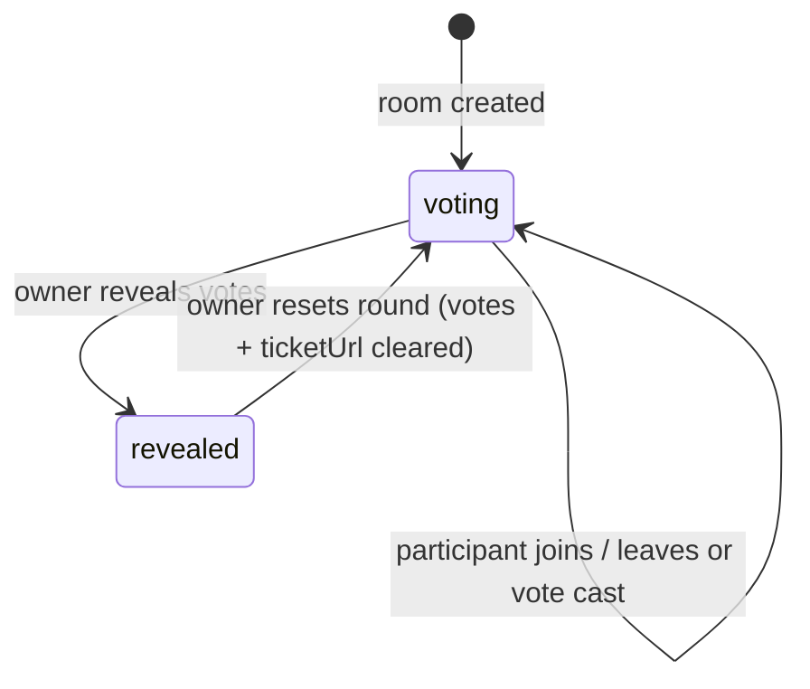

# Architecture Overview

Story Pointer is a real-time planning poker application for agile teams. Participants join a shared room, cast story point votes privately, and the room owner reveals all votes simultaneously to avoid anchoring bias. Rooms are ephemeral — state lives in server memory and is lost on restart.

## Monorepo Layout

```
story-pointer/
├── server/       Express + Socket.io — all room logic and real-time state
├── client/       React 19 SPA — stateless renderer, driven by server state
└── docs/         Architecture and reference documentation
```

Both workspaces share dev tooling (Vitest, ESLint, Prettier) from the root `package.json`.

## System Architecture



In development, Vite proxies `/api` and `/socket.io` to `localhost:3001`. In production, Express serves the compiled React bundle as static files, so a single process handles everything.

## Request / Event Flows

**Creating a room:**

1. Browser `POST /api/rooms` → Express → `roomManager.createRoom()` → returns `{ roomId }`
2. Browser navigates to `/room/:roomId`

**Joining a room:**

1. Browser `GET /api/rooms/:id` → verifies room exists
2. User selects a role → `useRoom.join(role)` connects the socket and emits `room:join`
3. Server calls `addParticipant()`, then `broadcastState()` — sends personalized `room:state` to every participant in the room

**Casting a vote:**

1. Browser emits `vote:cast { value }`
2. Server calls `castVote()` (toggle: same value twice clears the vote), then `broadcastState()`
3. During voting phase, `sanitizeState()` hides the actual vote value — other clients only see `hasVoted: true`

**Revealing votes:**

1. Owner emits `vote:reveal`
2. Server changes `phase` to `'revealed'`, then `broadcastState()`
3. `sanitizeState()` now includes vote values for all clients

**Starting a new round:**

1. Owner emits `room:reset`
2. Server clears all votes, resets `phase` to `'voting'`, clears `ticketUrl`, then `broadcastState()`

## Voting State Machine



Voting is blocked once the phase is `revealed`. Only the room owner can transition between phases.

## Key Architectural Decisions

**In-memory room storage**
Rooms are stored in a `Map` on the server process. There is no database. This keeps the stack simple and matches the use case — planning sessions are short-lived and losing state on restart is acceptable.

**Server-side vote sanitization**
The server never sends vote values to clients during the `voting` phase. Only `hasVoted: true/false` is exposed. This prevents any client-side trick from revealing votes early and is enforced in `sanitizeState()` in `roomManager.js`.

**Full-state broadcast on every mutation**
After every change, `broadcastState()` sends the complete room state to every participant. This avoids the complexity of tracking per-client deltas and makes the client a simple stateless renderer.

**Personalized state per socket**
Each participant receives a state object that identifies them via a `you` field (their own socket ID). The client uses this to derive `isOwner` and to highlight their own participant card — without the server needing to send different data for every field.

**Owner-controlled actions enforced server-side**
`revealVotes`, `resetRoom`, and `setTicketUrl` all check `room.ownerId === socket.id` on the server before executing. The UI hides these controls from non-owners, but the server is the authority.

**nanoid for room IDs**
Room IDs are 8-character alphanumeric strings generated by `nanoid`. They are short enough for URLs but unguessable — no sequential IDs that could be enumerated.

**Dynamic display names computed server-side**
Display names like "Dev", "Dev 1", "Dev 2" are computed in `roomManager` whenever participants join or leave. Doing this server-side means every client sees consistent names without any coordination logic in the browser.

**Vote toggle semantics**
Casting the same vote value a second time clears the vote (`null`). This feels natural in the UI and avoids needing a separate "clear vote" action.
